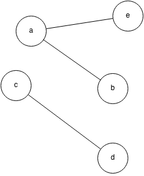
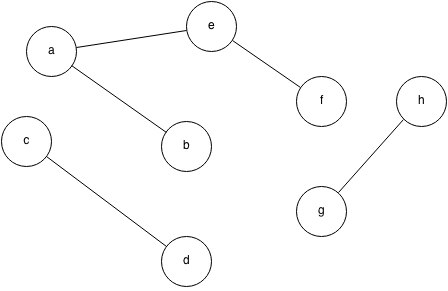
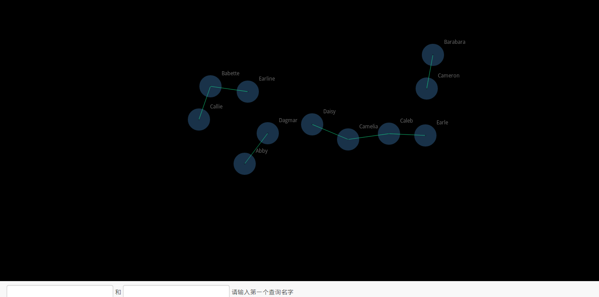
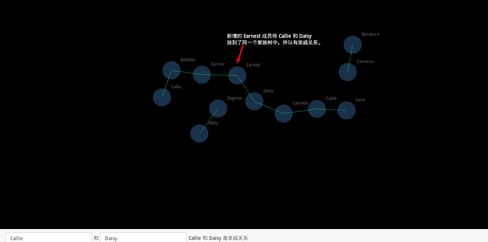

======================
数据结构课程设计：亲戚
======================

一、 题目描述
=============

::

   或许你并不知道，你的某个朋友是你的亲戚。他可能是你的曾祖父的外公的女婿的外甥的表姐的孙子。如果能得到完整的家谱，判断两个人是否亲戚应该是可行的，但如果两个人的最近公共祖先与他们相隔好几代，使得家谱十分庞大，那么检验亲戚关系实非人力所能及.在这种情况下，最好的帮手就是计算机。为了将问题简化，你将得到一些亲戚关系的信息，如同Marry和Tom是亲戚，Tom和Ben是亲戚，等等。从这些信息中，你可以推出Marry和Ben是亲戚。请写一个程序，对于我们的关心的亲戚关系的提问，以最快的速度给出答案。

二、数据输入格式
================

为了更好地分析、解决这个问题，定义如下的输入/输出格式：

输入描述
++++++++

::

  3
  a
  b
  c
  5
  b a
  c b
  b c
  c a
  c a
  4
  c a
  a c
  a b
  c a

其中第一行为家族成员个数 :math:`N` ，接下来的 :math:`N` 行是家族成员的名字；
第 :math:`N + 2` 行是成员关系数 :math:`R` ，接下来的 :math:`R` 行是成员关系描述，
每行有两个空格分隔的字符串 :math:`A` 和 :math:`B` ，分别指代一位家族成员。
一行关系描述代表 :math:`A` 和 :math:`B` 具有亲戚关系。接下来的一行为查询数目 :math:`Q` ，
后续的 :math:`Q` 行为查询描述，每行有两个空格分隔的字符串 :math:`C` 和 :math:`D` ，
分布指代一位家族成员。一行查询是指询问这两位成员是否具有亲戚关系。

输出描述
++++++++

对于 :math:`Q` 条查询，程序应该输出 :math:`Q` 条查询结果： `TRUE` 代表本次查询中的两个成员具有亲戚关系， `FALSE` 则代表没有。

三、问题分析
============

亲戚关系分析
------------

根据现实生活中的定义， :math:`A` 和 :math:`B` 有亲戚关系（记作 :math:`R(A, B)` ），应该满足以下条件：

- 如果 :math:`A` 和 :math:`B` 是同一个人，那么他们具有亲戚关系;
- 如果存在一个成员 :math:`C` 满足 :math:`R(A, C)` ，又有 :math:`R(C, B)` ，则有 :math:`R(A, B)` ；

同时易知 :math:`R(A, B) = R(B, A)` 。

综上可知，亲戚关系是定义在家族成员集合 :math:`F = \{A, B, C, ...\}` 上的一个 **等价关系** 。

问题模型抽象
------------

从亲戚关系是 **等价关系** 这个基础出发，我们可以把问题抽象成如下的模型：

- 整个程序输入构成一个 **无向图** :math:`G(V, E)`
- 家族成员集合 :math:`F = \{A, B, C, ...\}` 构成这个图的结点集合 :math:`V`
- 家族成员关系集合 :math:`R = {(A, B), (B, C), ...}` 构成这个图的边集合 :math:`E` ，
  即假如成员 :math:`A` 和 :math:`B` 满足 :math:`R(A, B)` ，则图中该两结点之间存在一条边

一个简单的例子如下：

             而这两个连通分量之间的结点没有亲戚关系

于是程序的查询就变成：求图 :math:`G(V, E)` 中任意两个结点是否在同一个连通分量中。

四、问题解决
============

选择数据结构
------------

从上面分析可以看出，解决这个问题的关键在于使用怎么样的数据结构可以最快捷方便地进行关于两个
结点是否在同一个连通分量内的查询。

又因为问题的输入是已知图的结构，然后对图进行查询，所以我们可以采用*并查集*这一数据结构。

并查集
------

并查集是一种树形数据结构，记录着一系列元素；并把这一系列的元素分组成一系列不相关的集合。

该数据结构主要支持两个操作：

- ``union`` 将两个不相关的集合合并成一个集合
- ``find`` 求任意一个元素所在集合

该数据结构操作的基本时间复杂度为 :math:`O(nlog(n))`

算法描述
--------

对于每一个家族树，我们使用并查集里面的一个集合表示，那么一个亲友关系就可以变成在该并查集上的
一次 ``union`` 操作；一次查询则是一次 ``find`` 操作。整个程序的预期时间复杂度为 :math:`O(nlog(n) + qlog(q))` 。

五、运行结果
============

结果验证
--------

为了检验程序的正确性，使用如下的测试数据进行测试：

查询次序：

::
  
  c d
  g h
  a f
  c g
  b d
  b g

查询结果：

::

  TRUE
  TRUE
  TRUE
  FALSE
  FALSE
  FALSE

结合上面的图例，可以知道程序运行正确。

运行效率
--------

为了更好地测试程序的运行效率，使用了如下几组规模的数据：

+-------------------+--------------------+------------------+
|家族成员总规模 (N) | 成员关系规模（R）  | 关系查询规模（Q）|
+===================+====================+==================+
| 50                |    50              |    2500          |
+-------------------+--------------------+------------------+
| 50                |    500             |    250000        |
+-------------------+--------------------+------------------+
| 50                |    1000            |    1000000       |
+-------------------+--------------------+------------------+
| 50                |    2000            |    1000000       |
+-------------------+--------------------+------------------+
| 50                |    2500            |    1000000       |
+-------------------+--------------------+------------------+
| 5000              |    500             |    5000          |
+-------------------+--------------------+------------------+
| 5000              |    5000            |    15000         |
+-------------------+--------------------+------------------+
| 5000              |    10000           |    25000         |
+-------------------+--------------------+------------------+
| 5000              |    25000           |    1000000       |
+-------------------+--------------------+------------------+
| 5000              |    50000           |    1000000       |
+-------------------+--------------------+------------------+
| 5000              |    100000          |    1000000       |
+-------------------+--------------------+------------------+
| 20000             |    500             |    5000          |
+-------------------+--------------------+------------------+
| 20000             |    5000            |    15000         |
+-------------------+--------------------+------------------+
| 20000             |    10000           |    25000         |
+-------------------+--------------------+------------------+
| 20000             |    25000           |    1000000       |
+-------------------+--------------------+------------------+
| 20000             |    100000          |    1000000       |
+-------------------+--------------------+------------------+

生成这几组数据的程序可见附录。

测试结果如下：

+-------------------+-------------------+-------------------+------------+-------------------+--------------------+
|家族成员总规模 (N) | 成员关系规模（R） | 关系查询规模（Q） |  运行次数  | 总运行时间（毫秒）|单次运行时间（毫秒）|
+===================+===================+===================+============+===================+====================+
|50                 |  50               |   2500            | 10000      | 3310              |  0.331             |
+-------------------+-------------------+-------------------+------------+-------------------+--------------------+
|50                 |  500              |   250000          |    1000    |    33670          |     33.67          |
+-------------------+-------------------+-------------------+------------+-------------------+--------------------+
|50                 |  1000             |   1000000         |    20      |    2790           |     139.5          |
+-------------------+-------------------+-------------------+------------+-------------------+--------------------+
|50                 |  2000             |   1000000         |    20      |    2590           |     129.5          |
+-------------------+-------------------+-------------------+------------+-------------------+--------------------+
|50                 |  2500             |   1000000         |    20      |    2810           |     140.5          |
+-------------------+-------------------+-------------------+------------+-------------------+--------------------+
|5000               |  500              |   5000            |    1000    |    1480           |     1.48           |
+-------------------+-------------------+-------------------+------------+-------------------+--------------------+
|5000               |  5000             |   15000           |    1000    |    3650           |     3.65           |
+-------------------+-------------------+-------------------+------------+-------------------+--------------------+
|5000               |  10000            |   25000           |    100     |    350            |     3.5            |
+-------------------+-------------------+-------------------+------------+-------------------+--------------------+
|5000               |  25000            |   1000000         |    10      |    1240           |     124            |
+-------------------+-------------------+-------------------+------------+-------------------+--------------------+
|5000               |  50000            |   1000000         |    10      |    1220           |     122            |
+-------------------+-------------------+-------------------+------------+-------------------+--------------------+
|5000               |  100000           |   1000000         |    10      |    1360           |     136            |
+-------------------+-------------------+-------------------+------------+-------------------+--------------------+
|20000              |  500              |   5000            |    1000    |    3500           |     3.5            |
+-------------------+-------------------+-------------------+------------+-------------------+--------------------+
|20000              |  5000             |   15000           |    1000    |    5220           |     5.22           |
+-------------------+-------------------+-------------------+------------+-------------------+--------------------+
|20000              |  10000            |   25000           |    100     |    750            |     7.5            |
+-------------------+-------------------+-------------------+------------+-------------------+--------------------+
|20000              |  25000            |   1000000         |    10      |    1390           |     139            |
+-------------------+-------------------+-------------------+------------+-------------------+--------------------+
|20000              |  50000            |   1000000         |    50      |    7580           |     151.6          |
+-------------------+-------------------+-------------------+------------+-------------------+--------------------+
|20000              |  100000           |   1000000         |    50      |    7340           |     146.8          |
+-------------------+-------------------+-------------------+------------+-------------------+--------------------+

从上述结果可以看出程序具有和预期一致的效率。

六、总结
========

通过解决这个问题，我学习到了高效的数据结构对解决问题有非常大的帮助。
在这个问题上，假如使用普通的树或者图作为底层数据结构，必定会使程序运行时间翻倍增长。
如同 Linus Torvals 所说的那样： ::

  Bad programmers worry about the code. Good programmers worry about data structures and their relationships.

在解决一个问题之前应该首先彻底了解这个问题，并设计好整体的数据模型，这样才能事半功倍，得到更好的效果。

七、程序代码
============

.. code:: C

  #include <stdio.h>
  #include <stdlib.h>
  #include <string.h>

  #define MAX_PERSON_COUNT 20000  /* Person capacity limit */
  #define MAX_PERSON_NAME_LENGTH 50  /* Person name maximum length */
  #define EMPTY_NAME_PREFIX 0
  #define HAS_RELATIONSHIP "TRUE"
  #define HAS_NO_RELATIONSHIP "FALSE"

  char PERSON[MAX_PERSON_COUNT][MAX_PERSON_NAME_LENGTH];  /* Person names set */
  int PERSON_ANCESTOR[MAX_PERSON_COUNT];  /* Person ancestor set */

  /*
   * Read persons list from stdin.
   *
   * :param n: list size, should <= MAX_PERSON_COUNT.
   * :param array: persons list.
   * :param array: person ancestors list. 
   */
  void read_persons(int, char (*)[MAX_PERSON_NAME_LENGTH], int *);

  /*
   * Union two persons.
   *
   * :param n: union times.
   * :param array: persons list.
   * :param array: person ancestors list. 
   */
  void union_persons(int, char (*)[MAX_PERSON_NAME_LENGTH], int *);

  /*
   * Query from relationship
   *
   * :param n: query times.
   * :param array: persons list.
   * :param array: person ancestors list. 
   */
  void query_relationship(int, char (*)[MAX_PERSON_NAME_LENGTH], int *);

  int main()
  {
      int name_count, relationship_count, query_count;
      int i;

      for (i = 0; i < MAX_PERSON_COUNT; i++)
          PERSON[i][0] = EMPTY_NAME_PREFIX;

      scanf("%d", &name_count);
      read_persons(name_count, PERSON, PERSON_ANCESTOR);

      scanf("%d", &relationship_count);
      union_persons(relationship_count, PERSON, PERSON_ANCESTOR);

      scanf("%d", &query_count);
      query_relationship(query_count, PERSON, PERSON_ANCESTOR);

      return 0;
  }

  void *Malloc(size_t size)
  {
      void *buffer;

      if ((buffer = malloc(size)) == NULL)
          exit(-1);
      return buffer;
  }

  void read_persons(int n,
                    char (*persons)[MAX_PERSON_NAME_LENGTH],
                    int *ancestors)
  {
      int i;

      for (i = 0; i < n; i++) {
          scanf("%s", persons[i]);
          ancestors[i] = i;
      }
  }

  /*
   * Find person index with name.
   *
   * ..info:
   *  
   *     The running time is O(n).
   *
   * :param name: person's name.
   * :param persons: person names set.
   * :rtype: int, returns `-1` if the name not in the test.
   */
  int find_person(char *name, char (*persons)[MAX_PERSON_NAME_LENGTH])
  {
      int i;

      for (i = 0; i < MAX_PERSON_NAME_LENGTH; i++) {
          if (persons[i][0] == EMPTY_NAME_PREFIX)
              break;
          if (strcmp(name, persons[i]) == 0)
              return i;
      }

      return -1;
  }

  /*
   * Find person's ancestor (\w path compression).
   *
   * :param a: person's index.
   * :param ancestors: ancestors list.
   */
  int find_(int a, int *ancestors)
  {
      /* Perform path compression for new query. */
      for (; a != ancestors[a] ; a = ancestors[a])
          ;
      return a;
  }

  /*
   * Union two person.
   *
   * TODO union by rank.
   *
   * :param a, b: persons' index.
   * :param ancestors: ancestors list.
   */
  void union_(int a, int b, int *ancestors)
  {
      int ap, bp;

      ap = find_(a, ancestors);
      bp = find_(b, ancestors);

      /* TODO union by rank */
      ancestors[ap] = bp;
  }

  void union_persons(int n,
                     char (*persons)[MAX_PERSON_NAME_LENGTH],
                     int *ancestors)
  {
      int i, a_idx, b_idx;
      char a_name[MAX_PERSON_NAME_LENGTH], b_name[MAX_PERSON_NAME_LENGTH];

      for (i = 0; i < n; i++) {
          scanf("%s %s", a_name, b_name);
          /* TODO Error handling here. */
          a_idx = find_person(a_name, persons);
          b_idx = find_person(b_name, persons);

          union_(a_idx, b_idx, ancestors);
      }
  }

  void query_relationship(int n,
                          char (*persons)[MAX_PERSON_NAME_LENGTH],
                          int *ancestors)
  {
      int i, a_idx, b_idx;
      char a_name[MAX_PERSON_NAME_LENGTH], b_name[MAX_PERSON_NAME_LENGTH];

      for (i = 0; i < n; i++) {
          scanf("%s %s", a_name, b_name);
          /* TODO Error handling here. */
          a_idx = find_person(a_name, persons);
          b_idx = find_person(b_name, persons);

          if (find_(a_idx, ancestors) == find_(b_idx, ancestors))
              printf("%s\n", HAS_RELATIONSHIP);
          else
              printf("%s\n", HAS_NO_RELATIONSHIP);
      }
  }

八、附录
========

测试数据产生程序
----------------

根据输入数据的要求，使用 Go 语言写了一个数据生成程序。

.. code:: go

  package main

  /*
  This application is used for generating random data for `relationship` program.

  Usage Examples:

      ./generator
      ./generator -name 25 -relationship 90 -query 60

  Default Parameters:

      name: 10
      relationship: 80
      query: 120

  Output Format:

  3       # NAME COUNT
  a
  b
  c
  2       # RELATIONSHIP COUNT
  a b
  c b
  2       # QUERY COUNT
  a b
  c b
  */

  import (
          "flag"
          "fmt"
          "math/rand"
          "strings"
          "time"
  )

  const (
          NAME_COUNT         = 10
          RELATIONSHIP_COUNT = 80
          QUERY_COUNT        = 120

          NAME_MINIMUM_LENGTH   = 5
          NAME_MAXIMUM_LENGTH   = 50
          CHARACTER_SETS        = "abcdefghijklmnopqrstuvwxyzABCDEFGHIJKLMOPQRSTUVWXYZ0123456789"
          CHARACTER_SETS_LENGTH = len(CHARACTER_SETS)
  )

  type Options struct {
          Name, Relationship, Query int
  }

  // Parse generate options from command line.
  func (o *Options) ParseFromFlags() {
          flag.IntVar(&o.Name, "name", NAME_COUNT, "Unique names to be generated.")
          flag.IntVar(&o.Relationship, "relationship", RELATIONSHIP_COUNT,
                  "Relationships pairs count.")
          flag.IntVar(&o.Query, "query", QUERY_COUNT, "Query count.")

          flag.Parse()
  }

  type Person struct {
          Name string
  }

  // Generate a person with given name.
  func NewPerson(name string) *Person {
          return &Person{name}
  }

  // Generate a person with random name.
  func NewRandomPerson() (p *Person) {
          name_length := RandomIntFromRange(NAME_MINIMUM_LENGTH, NAME_MAXIMUM_LENGTH)
          name := RandomString(name_length)

          return NewPerson(name)
  }

  // Print person structure.
  func (p Person) Print() {
          fmt.Println(p.Name)
  }

  type PersonSet struct {
          Capacity, Used int
          // XXX array/slice
          Persons []*Person
  }

  // Create a person set.
  func NewPersonSet(capacity int) *PersonSet {
          return &PersonSet{capacity, 0, make([]*Person, capacity, capacity)}
  }

  // Create a person set with random person.
  func NewRandomPersonSet(capacity int) *PersonSet {
          s := NewPersonSet(capacity)

          for !s.IsFull() {
                  s.Add(NewRandomPerson())
          }

          return s
  }

  // Check if the set contains specify person.
  func (s PersonSet) Contains(p *Person) bool {
          for i := 0; i < s.Used; i++ {
                  if s.Persons[i] == nil {
                          continue
                  }

                  if name := s.Persons[i].Name; p.Name == name {
                          return true
                  }
          }

          return false
  }

  // Add a person to set.
  func (s *PersonSet) Add(p *Person) error {
          if s.Contains(p) {
                  return PersonSetAddError{}
          }

          s.Persons[s.Used] = p
          s.Used = s.Used + 1

          return nil
  }

  // Indicate if the set is full.
  func (s PersonSet) IsFull() bool {
          return s.Used == s.Capacity
  }

  // Pick a person pair from set.
  func (s PersonSet) Pair(a, b int) (*Person, *Person) {
          return s.Persons[a], s.Persons[b]
  }

  // Pick randomly a person pair from set.
  func (s PersonSet) RandomPair() (*Person, *Person) {
          var a, b int
          a = RandomIntFromRange(0, s.Used)
          for b = a; a == b; {
                  b = RandomIntFromRange(0, s.Used)
          }

          return s.Pair(a, b)
  }

  // Print person set structure.
  func (s PersonSet) Print() {
          fmt.Println(s.Used)

          for i := 0; i < s.Used; i++ {
                  s.Persons[i].Print()
          }
  }

  type PersonSetAddError struct{}

  func (e PersonSetAddError) Error() string {
          return "Add failed."
  }

  // Generate a random string with given length.
  func RandomString(length int) (s string) {
          picked := make([]string, length, length)

          for ; length > 0; length -= 1 {
                  c := CHARACTER_SETS[RandomIntFromRange(0, CHARACTER_SETS_LENGTH)]
                  picked[length-1] = string(c)
          }

          return strings.Join(picked, "")
  }

  // Generate a random int from a range [lo, hi).
  func RandomIntFromRange(lo, hi int) int {
          return rand.Intn(hi-lo) + lo
  }

  func main() {
          // Seed the program.
          rand.Seed(time.Now().UnixNano())

          options := Options{}
          options.ParseFromFlags()

          s := NewRandomPersonSet(options.Name)

          // Print names
          s.Print()

          // Print relationships
          fmt.Println(options.Relationship)
          for i := 0; i < options.Relationship; i++ {
                  a, b := s.RandomPair()
                  fmt.Printf("%s %s\n", a.Name, b.Name)
          }

          // Print query
          fmt.Println(options.Query)
          for i := 0; i < options.Query; i++ {
                  a, b := s.RandomPair()
                  fmt.Printf("%s %s\n", a.Name, b.Name)
          }
  }

可视化测试程序
--------------

为了更好的演示程序和检验程序的正确性，提供了一个可视化的 html5 应用：

页面中的一个圆圈代表一个家族成员（双击页面黑色部分即可生成一个成员）；可以使用鼠标进行移动。
当两个结点距离足够近的时候就可以将它们相连（也就是一次联合操作，把两个成员归类到同一个家族里面。）

查询两个成员关系可以在下面两个文本输入框里输入对应成员的名字，输入之后会自动输出查询结果：

重新调整结点位置之后自动重新计算结果：

在线程序可以在 http://dou.bz/2Q6sQv 上获得。

九、参考资料

Thomas H.Cormen, Charles E.Leiserson, Ronald L.Rivest and  Clifford Stein 算法导论 9787111187776

Robert Sedgewick and Kevin Wayne Algorithms 9780321573513
