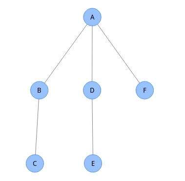
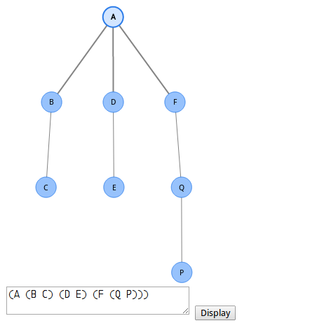

=====================
数据结构实验报告： 树
=====================


1. 题目
=======

本报告包括了 ``树`` 这一抽象数据结构的定义、具体实现以及测试代码。


数据对象及关系定义 （ADT 定义）
------------------------------

数据对象: ``D``

``D`` 是具有相同特性的数据元素的集合。


数据关系: ``R``

- 若 :math:`D=\emptyset`，则称 :math:`D` 为空树

- 若 :math:`D` 中仅含有一个数据元素，则 :math:`R` 为空集，
  否则 :math:`R=\{H\}`， :math:`H` 是如下二元关系:

    (1) 在 :math:`D` 中存在唯一的称为根的数据元素 :math:`root`，
    它在关系 :math:`H` 下无前驱;

    (2) 若 :math:`D - \{root\} \neq \emptyset`，则存在 :math:`D - \{root\}` 的
    一个划分 :math:`D_{1}, D_{2}, ..., D_{m} \, (m > 0)`，
    对任意 :math:`j \neq k \, (1 \leq j, \, k \leq m)` 
    有 :math:`D_{j} \cap D_{k} = \emptyset`，
    且对任意的 :math:`i \, (1 \leq i \leq m)`, 
    唯一存在数据元素 :math:`x_{i} \subset D_{i}`，
    有 :math:`<root, \, x_{i}> \in H`;

    (3) 对应于 :math:`D - \{root\}` 的划分，
    :math:`H - \{<root, x_{i}>, \, ..., \, <root, x_{m}>\}`
    有唯一的一个划分 :math:`H_{1}, \, H_{2}, \, ..., \, H_{m} \, (m > 0)`,
    对任意 :math:`j \neq k \, (1 \leq j, k \leq m)`
    有 :math:`D_{j} \cap D_{k} = \emptyset`，且对任意 :math:`i \, (1 \leq i \leq m)`,
    :math:`H_{i}` 是 :math:`D_{i}` 上的二元关系，
    :math:`(D_{i}, \, {H_{i}})` 是一颗符合本定义的树，称为根 :math:`root` 的子树。


数据结构的基本操作
==================


创建并初始化一棵空树。

.. code:: C

    struct tree *tree_init();


销毁一棵树及其所有子节点。

.. code:: C
    
    void tree_destory(struct tree *t);


将一棵树置为空树

.. code:: C
    
    void tree_clear(struct tree *t);


检测树是否为空

.. code:: C

    int tree_is_empty(struct tree *t);


获取结点的值

.. code:: C
    
    char *tree_value(struct tree *t);


对结点进行赋值

.. code:: C

    void tree_assign(struct tree *t, char *data);


向树插入新结点到第 i 位

.. code:: C

    void tree_insert_child(struct tree *t, struct tree *child, int i);


从树中删除并返回第 i 个结点

.. code:: C
    
    struct tree *tree_delete_child(struct tree *t, int i);

    
计算树的深度

.. code:: C

    int tree_depth(struct tree *t);


获取树的根

.. code:: C

    struct tree *tree_root(struct tree *t);


获取结点的父结点

.. code:: C

    struct tree *tree_parent(struct tree *t);


获取结点的左儿子

.. code:: C

    struct tree *tree_left_child(struct tree *t);


获取结点的右兄弟

.. code:: C

    struct tree *tree_right_sibling(struct tree *t);


对树执行先根遍历

.. code:: C

    void tree_traverse_pre_root(struct tree *t, void (*visitor)(struct tree *));


对树执行后根遍历

.. code:: C

    void tree_traverse_post_root(struct tree *t, void (*visitor)(struct tree *));


从字符串定义创建一棵树

参见： 从图形定义到程序定义_

.. code:: C

    struct tree *tree_from_string(char *s);


生成树的字符串形式

参见： 从程序定义到图形演示_

.. code:: C

    char *tree_stringify(struct tree *t);


2. 存储结构定义
===============


链树实现
--------

结构体定义：

.. code:: C

    struct tree {
        /* 数据域 */
        char *data;
        
        /* 父结点域 */
        struct tree *parent;

        /* 左儿子域 */
        struct tree *left_child;

        /* 右兄弟域 */
        struct tree *right_sibling;
    }


实现说明：

链树实现充分使用了链表这种离散结构的特性，将树的层级结构通过指针引用串联起来。
通过一系列的指针引用，可以很方便地遍历任意树的：结点值 (``data``)、父结点引用(``parent```)
以及子树序列(通过 ``left_child`` 和各个子树结点的 ``right_sibling``)。


3. 算法设计
===========


ADT 操作实现
------------

下面是链树各个操作的具体实现：


``tree_init``
+++++++++++++

.. code:: C

    struct tree *tree_init()
    {
        struct tree *t;

        t = (struct tree *) malloc(sizeof(struct tree));
        t->data = NULL;
        t->parent = NULL;
        t->left_child = NULL;
        t->right_sibling = NULL;

        return t;
    }

``tree_destory``
++++++++++++++++

.. code:: C

    void tree_destory(struct tree *t)
    {
        struct tree *p;
        struct tree *next;

        if (t == NULL)
            return;

        for (p = tree_left_child(t), next = NULL; p != NULL; p = next) {
            next = tree_right_sibling(p);
            tree_destory(p);
        }

        free(t->data);
        free(t);
    }


``tree_clear``
++++++++++++++

.. code:: C

    void tree_clear(struct tree *t)
    {
        if (t != NULL) {
            free(t->data);
            t->left_child = NULL;
        }
    }


``tree_is_empty``
+++++++++++++++++

.. code:: C

    int tree_is_empty(struct tree *t)
    {
        return ((t == NULL) ||
                (t->data == NULL && tree_left_child(t) == NULL));
    }


``tree_value``
++++++++++++++

.. code:: C

    char *tree_value(struct tree *t)
    {
        if (t == NULL)
            return NULL;
        return t->data;
    }


``tree_assign``
+++++++++++++++

.. code:: C

    void tree_assign(struct tree *t, char *data)
    {
        if (t == NULL || data == NULL)
            return;
        
        t->data = str_copy(data);
    }


``tree_insert_child``
+++++++++++++++++++++

.. code:: C

    void tree_insert_child(struct tree *t, struct tree *child, int i)
    {
        int j;
        struct tree fake;
        struct tree *p;

        if (i < 0)
            i = 0;

        for (fake.right_sibling = tree_left_child(t), p = &fake, j = 0;
             j < i && tree_right_sibling(p) != NULL;
             p = tree_right_sibling(p), j++)
            ;

        child->right_sibling = tree_right_sibling(p);
        p->right_sibling = child;
        p->parent = t;
        t->left_child = tree_right_sibling(&fake);
    }


``tree_delete_child``
+++++++++++++++++++++

.. code:: C

    struct tree *tree_delete_child(struct tree *t, int i)
    {
        int j;
        struct tree fake;
        struct tree *p, *rv;

        if (i < 0)
            return NULL;

        for (fake.right_sibling = tree_left_child(t), p = &fake, j = 0;
             j < i && p != NULL;
             p = tree_right_sibling(p), j++)
            ;

        if (p == NULL)
            return NULL;

        rv = p->right_sibling;
        if (rv != NULL) {
            p->right_sibling = rv->right_sibling;
            
            rv->parent = NULL;
            rv->right_sibling = NULL;
        }

        t->left_child = tree_right_sibling(&fake);

        return rv;
    }


``tree_depth``
++++++++++++++

.. code:: C

    int tree_depth(struct tree *t)
    {
        struct tree *p;
        int max_depth, sub_depth;

        if (t == NULL || tree_is_empty(t))
            return 0;

        for (p = tree_left_child(t), max_depth = 0;
             p != NULL;
             p = tree_right_sibling(p)) {
            sub_depth = tree_depth(p);
            if (sub_depth > max_depth)
                max_depth = sub_depth;
        }

        return max_depth + 1;
    }


``tree_root``
+++++++++++++

.. code:: C

    struct tree *tree_root(struct tree *t)
    {
        struct tree *parent;

        if (t == NULL)
            return NULL;

        while ((parent = tree_parent(t)) != t)
            t = parent;

        return t;
    }


``tree_parent``
+++++++++++++++

.. code:: C

    struct tree *tree_parent(struct tree *t)
    {
        if (t == NULL)
            return NULL;

        if (t->parent == NULL)
            return t;
        return t->parent;
    }


``tree_left_child``
+++++++++++++++++++

.. code:: C

    struct tree *tree_left_child(struct tree *t)
    {
        if (t == NULL)
            return NULL;

        return t->left_child;
    }


``tree_right_sibling``
++++++++++++++++++++++

.. code:: C

    struct tree *tree_right_sibling(struct tree *t)
    {
        if (t == NULL)
            return NULL;

        return t->right_sibling;
    }


``tree_traverse_pre_root``
++++++++++++++++++++++++++

.. code:: C

    void tree_traverse_pre_root(struct tree *t, void (*visitor)(struct tree *))
    {
        struct tree *p;

        if (t == NULL)
            return;

        visitor(t);

        for (p = tree_left_child(t); p != NULL; p = tree_right_sibling(p))
            tree_traverse_pre_root(p, visitor);
    }


``tree_traverse_post_root``
+++++++++++++++++++++++++++

.. code:: C

    void tree_traverse_post_root(struct tree *t, void (*visitor)(struct tree *))
    {
        struct tree *p;

        if (t == NULL)
            return;

        for (p = tree_left_child(t); p != NULL; p = tree_right_sibling(p))
            tree_traverse_pre_root(p, visitor);
        
        visitor(t);
    }


``tree_from_string``
++++++++++++++++++++

.. code:: C

    struct tree *tree_from_string(char *s)
    {
        struct queue *tokens;
        struct tree *t;

        tokens = tokenize(s);
        t = read_from(tokens);
        queue_destory(tokens);
        
        return t;
    }


``tree_stringify``
++++++++++++++++++

.. code:: C

    char *tree_stringify(struct tree *t)
    {
        int size, i;
        char *buf, *child_buf;
        struct tree *c;
        
        if (t == NULL)
            return NULL;
            
        size = tree_stringify_size(t) + 1;    
        buf = (char *) malloc(sizeof(char) * size);
        for (i = 0; i < size; i++)
            buf[i] = 0;
        buf[0] = '(';
        strcat(buf, tree_value(t));
        
        for (c = tree_left_child(t); c != NULL; c = tree_right_sibling(c)) {
            child_buf = tree_stringify(c);
            assert(child_buf != NULL);        
            strcat(buf, child_buf); 
            free(child_buf);
        }
        buf[size - 2] = ')';
            
        return buf;
    }


测试用例
--------


4. 调试与分析
=============


在实现和调试 ``树`` 这一数据结构的 ADT 过程中，主要遇到了以下两个问题：

- 如何从图形定义输入一棵树的结构到程序中？ （从图形定义到程序定义）

- 如何将操作后的树显示出来？ （从程序定义到图形演示）


从图形定义到程序定义
--------------------

``树`` 是一种计算机科学中常用的抽象数据结构，具有层次结构的特点。因此这一结构可
以很容易用图形的形式表示出来。不过对于只能理解普通逻辑的程序来说，则需要将图形
形式的树用逻辑的形式表示出来，这样才可以方便程序进行解析、操作。


为了更好地方便输入调试数据，测试程序采用了一种类似广义表的拓展 S 表达式形式，如
：

.. code:: lisp

    (A (B C) (D E) (F))


代表的就是一棵 3 层深的树：




该功能的实现参考了常规 ``Lisp`` 风格语言的解析实现，通过对输入进行分词(``tokenize``)、
递归下降解析来生成树的递归结构。使用了队列来辅助进行词法分析。具体代码实现可以
参考 ``tree_from_string`` 这一 ADT 方法。


从程序定义到图形演示
--------------------

在运行批量的操作之后，除了根据预期的树结构、结点值的变化来进行判别正确性以外，
还可以通过对程序内部的树的状态来生成图形化的效果。这样可以方便我们直观地看到操
作后树的变化。


为此程序提供了 ``tree_stringify`` 的方法来将一棵树转换成上述提到的广义表表达形
式（是 ``tree_from_string`` 的逆操作）；并通过配套的一个基于 ``HTML5`` 的浏览器端程
序即可将该树用图形形式展示出来。


这种可视化方法为演示 ADT 操作提供了极大的方便。


``HTML5`` 辅助程序运行截图：




5. 运行测试
===========


测试说明
--------

为了更方便地判定运行结果和预期结果是否一致，程序使用了类似 ``assert`` 的包装函
数，对判定结果进行判定，如果判定结果为假，则自动停止测试，并显示相应用例的错误
信息：

.. code:: c

    /* TODO copy from anyview */


测试结果
--------

TODO copy from anyview.


附录
====

参考资料
--------

[(How to Write a (Lisp) Interpreter (in Python))]_

.. [(How to Write a (Lisp) Interpreter (in Python))]::
    
    by Peter Norvig http://norvig.com/lispy.html


HTML5 演示程序
--------------

演示程序可以在 http://bl.ocks.org/bcho/raw/ea8db46ace9b4ba28897/ 获得。
